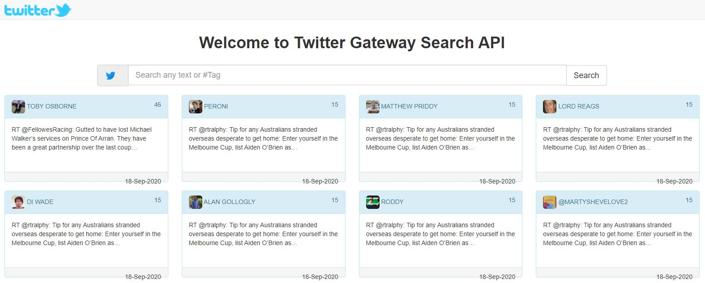

# Twitter Gateway


## Overview
This is an HTTP gateway to some cool social media public APIs (Twitter to start with!). In addition to routing, it can offer custom content enrichment. The solution is based on Java OSS frameworks (Spring boot, Apache Camel and Twitter4j) and is packaged as a docker container image.

## Main Features
- Search recent tweets by hashtags / keywords.
- Tweets are sort by popularity.
- TBC as more features added...
    - http://localhost

## Synopsis
To build (package) the docker image
```bash
$ ./mvnw clean package docker:build
```
To run the Docker container (Ctrl+C to remove container)
```bash
$ docker run -it --rm -p 80:8080 --name twitter-gateway twitter-gateway
```

To check container status
```bash
$ docker ps
CONTAINER ID        IMAGE                              COMMAND                  CREATED              STATUS                          PORTS                                                  NAMES
a366bfcac246        twitter-gateway                    "java -jar /app/twit…"   About a minute ago   Up About a minute (healthy)   0.0.0.0:80->8080/tcp                                   twitter-gateway
```

## Browse to the home page http://localhost
